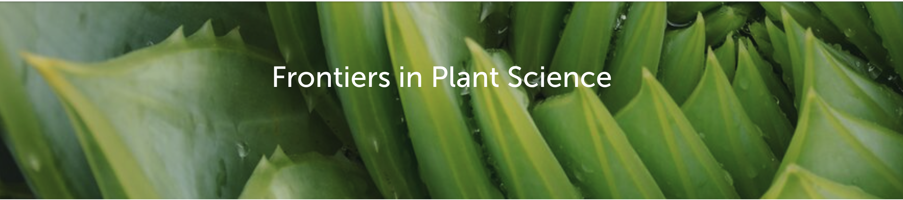

# Almond-Genotype-to-Phenotype-Prediction
[](https://doi.org/10.5281/zenodo.16778479)


## 📄 Paper Information

**Title:** Explainable artificial intelligence for genotype-to-phenotype prediction in plant breeding: a case study with a dataset from an almond germplasm collection 
**Authors:** Pierfrancesco Novielli, Donato Romano, Stefano Pavan, Pasquale Losciale, Anna Maria Stellacci, Domenico Diacono, Roberto Bellotti, Sabina Tangaro  
**Journal:** *Frontiers in Plant Science*, Volume 15 - 2024  
**DOI:** [10.3389/fpls.2024.1434229]([https://doi.org/10.3389/fpls.2024.1434229])  
**Published:** 09 September 9, 2024

<p align="center">

</p>

---

## 🧠 Project Overview

This repository contains the source code and environment specifications used for the analysis presented in the manuscript.  
The goal of the study was to identify explainable microbiome-derived biomarkers for colorectal cancer risk prediction using 16S rRNA data and XAI (SHAP-based) analysis.

The analysis includes:
- Preprocessing of microbiome and metadata
- ML model training (XGBoost, Random Forest, CatBoost)
- Global and local explanation using SHAP
- Embedding and clustering of adenoma patients
- SHAP interaction network analysis

---


## ⚙️ Environment Setup

The analysis was conducted in Python on the following system:

- **Operating System:** macOS 15.6  
- **Python Version:** 3.11.12

To reproduce the computational environment used in the study, we provide a Conda environment file.

### 🛠️ Installation

Make sure you have [Anaconda](https://www.anaconda.com/download) or [Miniconda](https://docs.conda.io/en/latest/miniconda.html) installed. Then:

```bash
# Clone the repository
git clone https://github.com/pierfrancesco2021/Personalized-Colorectal-Cancer-Risk-Assessment.git
cd CRC_microbiome_XAI

# Create environment from YAML
conda env create -f environment.yml

# Activate the environment
conda activate microbiome-crc
```
---

### 📊 SHAP Interaction Network Visualization

The notebook `notebooks/shapInteraction_risk.ipynb` computes and saves:
- **Node matrix** (`nodes.csv`)
- **Link matrix** (`edges.csv`)

These files represent the SHAP-based interaction network and can be directly imported into [Gephi](https://gephi.org/) for interactive visualization and exploration.

